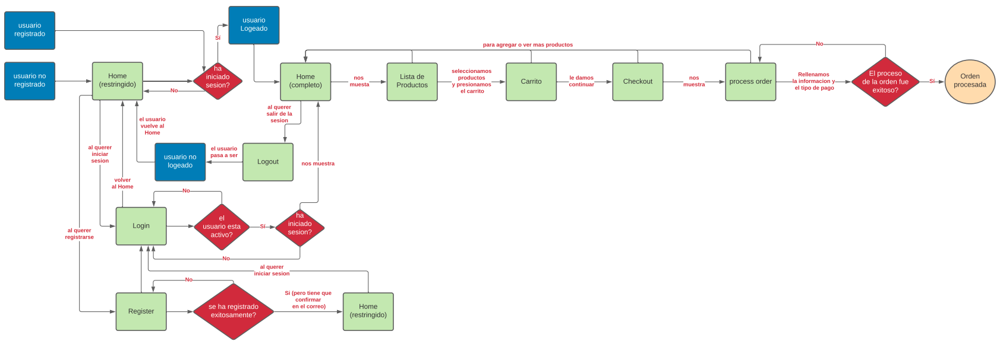

# Proyecto E-commerce "Vida Verde" - C2-G11

## Descripción
Proyecto E-commerce "Vida Verde" de compra-venta de frutas/verduras, empleando sistema de transaccion "Paypal", esta basado en Django 4 y MySQL 8 como base de datos.

## Requerimientos
	- Python v3.x
	- MySQL v8.x.x
	- Pip 20.x.x
	- python3.8-venv
## Esquema

## Pre-Instalación
### 1-Instalar Python
#### En Linux
    sudo apt-get install python3
#### En Windows
    descargar e instalar el paquete de instalacion desde la pagina https://www.python.org/downloads/
### 2-Instalar Pip
#### En Linux
    sudo apt install python3-pip
#### En Windows 
    1.descargar el archivo desde este link https://bootstrap.pypa.io/get-pip.py
    2.ejecutar con el siguiente comando "python get-pip.py"
### 3-Instalar virtual venv
#### En Linux
    sudo apt install python3.8-venv
#### En Windows
    pip install virtaulenv
### 4-Instalar MySql
#### En Linux
    sudo apt update
    sudo apt install mysql-server
    sudo mysql_secure_installation
  - fuente: https://www.digitalocean.com/community/tutorials/como-instalar-mysql-en-ubuntu-18-04-es
#### En Windows
    Descargar e instalar el paquete de instalacion desde la pagina https://dev.mysql.com/downloads/installer/

# Instalacion
	1. Descargar Repositorio
	2. Crear el entorno virtual
	3. Ingresar al entorno virtual
	4. Instalar desde Requirements.txt
	5. Crear la base de datos en MySQL 
	6. Modificar los parametros de la base de datos del archivo "./ecommerce/settings.py"
	7. ejecutar los comandos "makemigrations" y "migrate" para crear las tablas de la Base de Datos

	8. y como ultimo, para iniciar el servidor ejecutar el "runserver"

### 1. Descargar Repositorio
    git clone https://github.com/No-Country/C2-G11.git
### 2. Crear el entorno virtual
#### En Linux
    python3 -m venv [ruta de la carpeta]
#### En Windows
    python -m venv [ruta de la carpeta]
### 3-Ingresar al entorno virtual
#### En Linux
    source bin/activate
#### En Windows 
    source .venv/bin/activate
### 4-Instalar desde Requirements
    pip install -r requirements.txt
### 5-Crear la base de datos
    Ingresamos al MySQL Workbench (o aplicacion que gestione base de datos) y Crea la base de datos
### 6-Modificar los parametros de la base de datos del archivo "./ecommerce/settings.py"
#### Ejemplo DATABASES
    DATABASES = {
    'default': {
        'ENGINE': 'django.db.backends.mysql',
        'NAME': 'e-commerce',
        'USER': 'root',
        'PASSWORD': '123456789',
        'HOST': 'localhost',
        'PORT': 3306
      }
    }
#### Referencias
    "Name" es el nombre de la base de datos
    "User" es el nombre del usuario que la aplicacion va a utilizar en la base de datos
    "Host" es donde se encuentra alojado la base de datos
    "Password" es la contraseña asociada con el usuario para poder manipular la base de datos
    "Port" es el pueto que va a utilizar la base de datos
    
#### Ejemplo EMAIL
    EMAIL_USE_TLS = True
    EMAIL_HOST = 'smtp.gmail.com'
    EMAIL_HOST_USER = 'vidaverde.ecommerce@gmail.com'
    EMAIL_HOST_PASSWORD = 'Vidaverde1234'
    EMAIL_PORT = 587
#### Referencias
    "EMAIL_HOST" es el gestor de correo
    "EMAIL_HOST_USER" es la cuenta de correo que vamos a utilizar para los envios de EMAIL
    "EMAIL_HOST_PASSWORD" es la contraseña de la cuenta del correo
    "EMAIL_PORT" es el pueto que va a utilizar el sistema de Email
    
- Hay que tener en cuenta que debe estar habilitado "Acceso de aplicaciones poco seguras" en el caso que utilizemos "GMAIL". para habilitarlo deben dirigirse a la siguiente pagina:
    - https://myaccount.google.com/lesssecureapps?pli=1&rapt=AEjHL4O6djugp0K9wdt5-mPK4rdgrp11pAaZxX1HP_NUI1O0exktpWchRUp0Bgw5gMFeFOOidYfQLDaf6sp1Bjzc1rx2vyuExw

### 7-ejecutar los comandos "makemigrations" y "migrate" para crear las tablas de la Base de Datos
#### En Linux
    python3 manage.py makemigrations
    python3 manage.py migrate
#### En Windows
    python manage.py makemigrations
    python manage.py migrate
## 8-Ejecutar servidor
#### En Linux
    python3 manage.py runserver
#### En Windows
    python manage.py runserver
